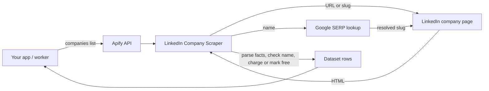

# LinkedIn Company Scraper Docs

[](https://apify.com/agnes.developer.queen/linkedin-company-scraper)
[](LICENSE)

Consumer documentation and integration examples for the LinkedIn Company Scraper actor on Apify. You send a list of LinkedIn company URLs, slugs or plain company names. You get back one row per company with industry, size, headquarters, founded year, website, followers and more. No LinkedIn login, no cookies.

The actor lives on Apify Store: https://apify.com/agnes.developer.queen/linkedin-company-scraper

The actor source is NOT in this repo. This repo holds the README, the input and output shape, and working examples in curl, Node and Python that call the public Apify API.

## What it does

Each entry in your `companies` list becomes one dataset row with these fields, all read from the public LinkedIn company page:

| Field | What it holds |
|---|---|
| `name` | Company name as shown on LinkedIn |
| `tagline` | The company's own tagline |
| `industry` | Industry as LinkedIn lists it |
| `companySize` | Size band, for example `5,001-10,000` |
| `employeesOnLinkedIn` | People on LinkedIn who list this company as their employer |
| `headquarters` | Headquarters as listed, or city and region from the page address |
| `city`, `region`, `countryCode` | Headquarters split out, country as ISO 3166 two letters |
| `founded` | Year founded |
| `companyType` | Privately Held, Public Company, Nonprofit and so on |
| `specialties` | Specialties list, `null` when LinkedIn shows none |
| `website` | Company website |
| `followers` | LinkedIn followers |
| `about` | The About text |
| `logoUrl` | Logo image URL |
| `linkedinUrl` | The company page that was read |
| `slug` | The company's LinkedIn URL name, handy as a dedupe key |
| `input` | What you typed, so you can join results back to your list |
| `charged` | `true` when this row was billed |
| `reason` | Why the row was or was not billed |
| `scrapedAt` | When the row was collected, ISO 8601 |

A `RUN_SUMMARY` record in the run's key-value store counts requested, delivered, charged, not found, blocked and name-mismatch rows.

Names work as well as URLs. A name such as `Kenya Airways` is first turned into a guessed slug (`kenya-airways`). If that page does not exist, or its name does not match what you typed, the actor runs a Google search limited to `linkedin.com/company` and takes the first company slug from the results. The resolved `linkedinUrl` and `slug` come back on the row so you can check the match.

## Architecture



## Request flow

```mermaid
sequenceDiagram
    participant App as Your App
    participant API as Apify API
    participant Actor as Company Scraper
    participant G as Google SERP
    participant LI as LinkedIn
    App->>API: POST /acts/agnes.developer.queen~linkedin-company-scraper/run-sync-get-dataset-items
    API->>Actor: Start run with {companies: [...]}
    loop each entry
        alt URL or slug
            Actor->>LI: GET /company/{slug}
        else company name
            Actor->>LI: GET /company/{guessed slug}
            Actor->>G: site:linkedin.com/company {name} (if guess missed)
            G-->>Actor: first company slug
            Actor->>LI: GET /company/{slug}
        end
        LI-->>Actor: public page HTML
        Actor->>Actor: parse facts, verify name
        Actor->>API: push row, charge "company" event only if delivered
    end
    API-->>App: dataset items
```

## Input

From `.actor/input_schema.json`:

| Field | Type | Default | Meaning |
|---|---|---|---|
| `companies` | array of strings, required | `["https://www.linkedin.com/company/stripe", "asana", "Kenya Airways"]` | LinkedIn company URLs, slugs or company names. 1 to 1,000 entries per run. A name is turned into a slug; if LinkedIn has no page at that slug the row comes back free with reason `company page not found`. |

Accepted forms, mixed freely in one list:

- URL: `https://www.linkedin.com/company/stripe` (country subdomains such as `ke.linkedin.com` work too)
- Slug: `stripe`
- Name: `Kenya Airways`, `Procter & Gamble`

The example input used throughout this repo is in [examples/input.json](examples/input.json):

```json
{
  "companies": [
    "https://www.linkedin.com/company/stripe",
    "asana",
    "Kenya Airways"
  ]
}
```

Showcase and school pages are not supported. Use the main company page URL.

## Output shape

The Stripe row, parsed from the page saved on 2026-09-29. Also in [examples/output.json](examples/output.json).

```json
{
  "input": "stripe",
  "linkedinUrl": "https://www.linkedin.com/company/stripe",
  "slug": "stripe",
  "name": "Stripe",
  "tagline": "Help increase the GDP of the internet.",
  "industry": "Technology, Information and Internet",
  "companySize": "5,001-10,000",
  "employeesOnLinkedIn": 16622,
  "headquarters": "South San Francisco, California",
  "city": "South San Francisco",
  "region": "California",
  "countryCode": "US",
  "founded": 2010,
  "companyType": "Privately Held",
  "specialties": null,
  "website": "https://stripe.com",
  "followers": 1737436,
  "about": "Stripe builds programmable financial services. Millions of companies...",
  "logoUrl": "https://media.licdn.com/dms/image/v2/...",
  "charged": true,
  "reason": "company profile delivered",
  "scrapedAt": "2026-09-29T13:02:14.637Z"
}
```

The output schema also exposes two links per run: `companies` (the dataset items URL) and `summary` (the `RUN_SUMMARY` record in the key-value store).

## Pricing

Pay per event, two events, as set on the actor:

| Event | Price | When |
|---|---|---|
| Actor start | $0.005 | Once per run |
| Company | $0.005 | Per company delivered with name, industry, size and location present |

Worked example: a run of 1,000 companies that all resolve costs 1,000 x $0.005 + $0.005 = $5.005. If 40 of them have no LinkedIn page, you pay for 960, so $4.805.

A company is not charged when:

- the page does not exist (`reason: "company page not found"`)
- the page loads but the facts block is missing, for example a login wall (`reason: "missing name, industry, size, location"` or the subset that was missing)
- you typed a name and the page found belongs to a different company (`reason: "name does not match page (...)"`)

Those rows still land in the dataset with `charged: false`, so you can see what was tried. Name lookups that do not resolve are free. The Apify free plan gives you $5 of platform credit every month, which covers roughly 990 companies a month once run-start fees are counted, with no credit card needed.

## Use cases

1. CRM enrichment. Push a column of company names from HubSpot or Salesforce, get industry, size band and HQ back, and fill the empty fields.
2. ABM account lists. Filter a target list by `companySize` and `industry` before sales spends time on it.
3. Investor and market mapping. Pull founded year, company type, HQ country and follower counts for every company in a sector.
4. Lead scoring by size and industry. `employeesOnLinkedIn` and `companySize` make a simple firmographic score without a paid data vendor.
5. Dedupe by slug. Different spellings of one company ("P&G", "Procter & Gamble") resolve to one `slug`, which makes a clean join key.

## Examples

See [examples/curl.sh](examples/curl.sh), [examples/node.js](examples/node.js) (uses `apify-client`) and [examples/python.py](examples/python.py) (uses `apify-client`). Each one runs the actor with [examples/input.json](examples/input.json) and prints the rows.

```
export APIFY_TOKEN=...
bash examples/curl.sh
npm install apify-client && node examples/node.js
pip install apify-client && python examples/python.py
```

No-code paths: Make, n8n and Zapier have an Apify app or node. Pick "Run an Actor", paste `agnes.developer.queen/linkedin-company-scraper` and map your company column to `companies`. For MCP clients, add `https://mcp.apify.com?actors=agnes.developer.queen/linkedin-company-scraper`.

## Authentication

You need an Apify API token. Get one at https://console.apify.com/account/integrations.

Set it as an environment variable:

```
APIFY_TOKEN=apify_api_xxxxxxxxxxxxxxxxxxxxx
```

The examples in this repo read `APIFY_TOKEN` from the environment. Never commit the token.

## Related actors

Other actors from the same author, each with its own docs repo:

- [LinkedIn People Search Scraper](https://github.com/agnesthedeveloper/linkedin-people-search-scraper)
- [Google Ads Transparency Scraper](https://github.com/agnesthedeveloper/google-ads-transparency-scraper)
- [LinkedIn Ad Library Scraper](https://github.com/agnesthedeveloper/linkedin-ad-library-scraper)
- [LinkedIn Jobs Scraper](https://github.com/agnesthedeveloper/linkedin-jobs-scraper)
- Hub with all of them: [agnes-apify-actors](https://github.com/agnesthedeveloper/agnes-apify-actors)

## Support

Found a company that comes back wrong, or free when it should not be? Open an issue on the Issues tab of the [Store page](https://apify.com/agnes.developer.queen/linkedin-company-scraper) with the input you used and the run ID.

## License

MIT, see [LICENSE](LICENSE). The license covers this documentation and the example files. The actor source is hosted on Apify and is not included in this repo.
